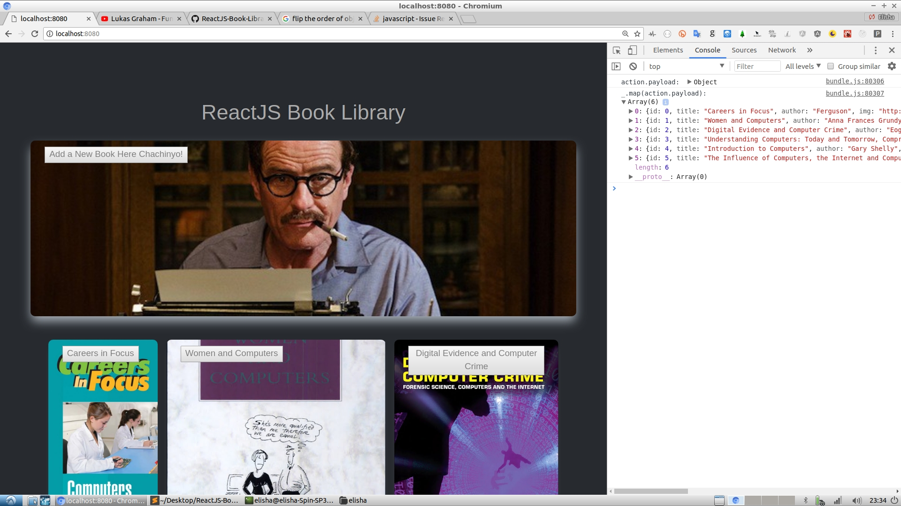

# ReactJS-Book-Library

<script type='text/javascript' src='https://cdnjs.cloudflare.com/ajax/libs/gist-embed/1.3/gist-embed.min.js'></script>



Using <a href="https://codepen.io/ivanodintsov/pen/yqvZzO">React Modal Animation Library</a> by Ivan Odintsov.

For testing: you can add axios to the main window object, and run in the Console:

```javascript
axios.get('https://www.googleapis.com/books/v1/volumes?q=harry')
  .then(function (response) {
    console.log(response);
  })
  .catch(function (error) {
    console.log(error);
});
```


<h3>Other interesting sources</h3>

<h5>Making the displayed books more interesting</h5>

https://medium.freecodecamp.org/build-a-best-sellers-list-with-new-york-times-google-books-api-46201c30aec7

With the New York Times API, you can fetch a list of top sellers. You can then fetch the book covers by querying the google books API with the ISBN (from the NYTimes results)

https://www.googleapis.com/books/v1/volumes?q=ISBN:0525557628

<h5>Higher Order Components (HOC)</h5>

Source: <a href="https://codeburst.io/forms-with-redux-form-v7-part-1-of-2-e636d760e9b4">Wrapping Our Form Container with Redux Form’s Higher Order Component</a>

"We start by making a container, a normal React component that renders FormComponent and wraps it with Redux Form’s reduxForm() helper. reduxForm() is a function that takes in a form configuration object and returns a HOC, a function that takes and returns a component.

The purpose of such wrapping in this case is to return the wrapped component with a bunch of helpers — functions that can change the state of the form or give you information as to whether a form field was touched or validated, or which fields are registered — passed through as props.

```javascript
import React from 'react';
import { reduxForm } from 'redux-form';

import FormComponent from './form.component';

export const FormContainer = props => {
  return (
    <FormComponent />
  );
}

const formConfiguration = {
  form: 'my-very-own-form'
}

export default reduxForm(formConfiguration)(FormContainer);
```

<code data-gist-id='6259775'>
  <!-- you dont have to put anything in here, but it provides a usable fallback if the script fails -->
  <br /><a href='https://gist.github.com/metatribal/6259775'>Click to view Gist... </a>
</code>

<code data-gist-id="gist43098316">
 <br /><a href='https://gist.github.com/metatribal/6259775'>Click to view Gist... </a>
</code>

Note: The most common example of HOC is probably Redux’s connect() function 

https://medium.freecodecamp.org/understanding-higher-order-components-6ce359d761b