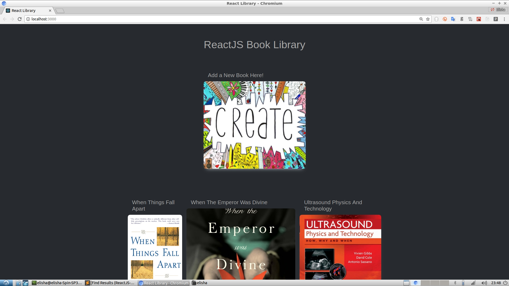

 - *ReactJS*
 - *Deployable to Heroku*
 - *Redux*
 - *Redux-Form*
 - *CRUD Operations*
 - *Form Validation*
 - *Responsive Design for Desktop/Mobile/Tablet*
 - *React-DatePicker*
 - *Google-Books API*
 - *Using <a href="https://codepen.io/ivanodintsov/pen/yqvZzO">React Modal Animation Library</a> by Ivan Odintsov.*
 - *React-Confirm-Alert (prompts user before deletes or if a book with the same title already exists)*



For testing: you can add axios to the main window object, and run in the Console:

```javascript
axios.get('https://www.googleapis.com/books/v1/volumes?q=harry')
  .then(function (response) {
    console.log(response);
  })
  .catch(function (error) {
    console.log(error);
});
```

Includes: CRUD Operations with React, Redux and the Google Books API

<h4>Deploying to Heroku</h4>


- You can only deploy to Heroku from the master branch. \
- The 'app.js' file in the root directory is the express server. It only serves the 'build' folder with this line:

```javascript
app.use(express.static(path.join(__dirname, 'build')));
```

Heroku automatically creates an optimized build for you when you deploy.

- Here are the commands for deployment:

```
git checkout master
git merge latest-branch
git push heroku master
```

The repo includes the <a href="https://chrome.google.com/webstore/detail/redux-devtools/lmhkpmbekcpmknklioeibfkpmmfibljd?hl=en">Redux Dev Tools Chrome Extension</a> for Development purposes.

If Redux Dev Tools is included in the deployed version, the app won't work for users that don't have the extension installed on their computer!

Therefore, within the <a href="src/index.js">src/index.js</a> we check the NODE_ENV variable - (which is set to 'production' when deployed to heroku)

```javascript
let store = {}

if (process.env.NODE_ENV === 'production') {
  store = createStore(reducers,
    {},
    compose(
      applyMiddleware(...middleware)
    )
  );
} else {
  store = createStore(reducers,
    {},
    compose(
      applyMiddleware(...middleware),
      window.__REDUX_DEVTOOLS_EXTENSION__ && window.__REDUX_DEVTOOLS_EXTENSION__()
    )
  );
}
```


<h4>The 3 Important Redux Store Methods</h4>

A redux store has 3 important methods on it:

 -  store.getState() - gets the state.
 -  store.subscribe() - listens for changes to the store
 -  store.dispatch() - sends an action to update/make changes to the store.


```javascript

import { createStore} from 'redux';

const store = createStore((state = 0, action) => {
  return action.type === 'increment' ? state + 1 : state;
});

console.log(store.getState());
store.subscribe(() => {
  console.log(store.getState());
})
store.dispatch({ type: 'increment' });
store.dispatch({ type: 'increment' });
store.dispatch({ type: 'increment' });
```

The above code will log:
```
0
1
2
3
```

<h2>Higher Order Components (HOC)</h2>

Question: What do Redux's connect() function, Redux-Form's reduxForm() function, and React Router’s withRouter() function have in common? 

Answer: They're all HOC's: functions that allow us to add additional properties to our components. A Higher Order Component (HOC), is a function that takes a child component and some options, then builds a container for that child.

It’s “higher order” in the same way as a “higher order function” — a function that builds a function. In fact you can think of React Components as functions that produce UI. This works especially well for functional stateless components, but if you squint, it works for pure stateful presentational components as well. A HOC is exactly a higher order function.

<h4>HOC #1: Redux Form</h4>

Let's look at an example with redux-form:

```javascript
import React from 'react';
import { reduxForm } from 'redux-form';

import FormComponent from './form.component';

export const FormContainer = props => {
  return (
    <FormComponent />
  );
}

const formConfiguration = {
  form: 'my-very-own-form'
}

export default reduxForm(formConfiguration)(FormContainer);
```

In the case of Redux-Form, the reduxForm function take in a form configuration object and returns a HOC, a function that takes and returns a component.

The purpose of such wrapping is to return the wrapped component with a bunch of helpers — functions that can change the state of the form or give you information as to whether a form field was touched or validated, or which fields are registered — passed through as props.

In the case of this repo, within the <a href="src/components/Modal/ImageContent.js">form-component</a>, you'll notice we're able to pull of a helper function handleSubmit from props, and then use it as an event handler for our JSX form-onSubmit event:

```javascript
render() {
    const { handleSubmit } = this.props;

    return (
    <div className="container">
      <form onSubmit={handleSubmit(this.onSubmit.bind(this))}>
        <Field
          label="Title For Book"
          name="title"
          component={this.renderField}
        />
```

How did that helper function get to be on props?

Answer: the reduxForm function that we saw in the previous example put it there by wiring up the built-in redux-form helpers with our existing component.

```javascript
export default reduxForm(formConfiguration)(FormContainer);
```

<h4>HOC #2: Redux</h4>

Let's flip to the actual Redux library. We'll start by explaining its general purpose:

<h6>Components before Redux</h6>

A React Application consists of a set of components. A component is passed a set of input properties (props) and produces some HTML which is rendered to the screen. When the component’s props change, it re-renders and the HTML may change.

A component’s render function returns one or instances of other components. In general, components interact only by passing props to their children or triggering callbacks passed by their parents.

So, how do we deal with global state?

One approach to global state is to attach it to the highest “root” component in your app and pass it down the tree to all the components that need it. You then pass all changes to that state back up the tree via a chain of callbacks.

This approach gets unwieldy pretty quickly, though - and you can quickly enter callback hell. Enter the hero: Redux.


<h6>Components after Redux</h6>

Redux allows components to access global state anywhere in the view tree, but not all components need access to the global state. Hence, the article by Dan Abramov, co-creator of Redux: <a href="https://medium.com/@dan_abramov/smart-and-dumb-components-7ca2f9a7c7d0">Presentational and Container Components</a>

- The container component does the “dirty” global state work.
- The presentational component does not.

Each container component needs to be concerned with 2 things:

- Which child component will it render? 
- And what data is it fetching?


Therefore, if we didn’t have react-redux's connect HOC, a container might look like this:

```javascript
// This is a vastly simplified implementation of what a Redux container would do
class MyComponentContainer extends Component {
  mapStateToProps(state) {
    // this function is specific to this particular container
    return state.foo.bar;
  }

  render() {
    // This is how you get the current state from Redux,
    // and would be identical, no mater what mapStateToProps does
    const { state } = this.context.store.getState();
    
    const props = this.mapStateToProps(state);
    
    return <MyComponent {...this.props} {...props} />;
  }
}
```

This is what the Redux's connect() function is doing for us behind the scenes. It fetches the global state (i.e. 'store') from Redux and then passes the state object through a 'mapStatesToProps' filter. Instead of passing your entire global state object into your new container, the mapStateToProps function allows you to set a filter on which state you pass into your new container.

Here's what the above code is essentially doing:

```javascript
const props = state.foo.bar;

return <MyComponent {...this.props} {...props} />;
```

So, in short, the connect function is adding {props: state.foo.bar} as a key-value pair to the newly generated component.  

Here's an example of how Redux is actually used in production (<a href="https://github.com/ElishaKay/reactjs-posts-and-emails/blob/add-posts/server/client/src/components/surveys/SurveyList.js">full context here</a>).

```
function mapStateToProps({ surveys }) {
  return { surveys };
}

export default connect(mapStateToProps, { fetchSurveys })(SurveyList);
```

In the above case, we're doing essentially the same thing. The mapStateToProps filter, pulls the surveys key-value pair off of the global state object. The surveys object is then passed in as a parameter to the connect() function.

With this example as context, let's try to answer the 2 questions that we asked above, that each container component needs to answer

- Which child component will it render? 
Answer: The SurveyList Component.

- And what data is it fetching off the global state?
Answer: The surveys data.

But what's the connect() function actually doing? How does it generate a new component?

Here's a dumbed-down version of what the connect() function does:

```javascript
function buildReduxContainer(ChildComponentClass, mapStateToProps) {
  return class Container extends Component {
    render() {
      const { state } = this.context.store.getState();

      const props = mapStateToProps(state);

      return <ChildComponentClass {...this.props} {...props} />;
    }
  }
}
```

The purpose of the connect() function is to build an Intelligent Redux Container. It filters through the global state according to your needs, takes that data and sets it as a prop of a newly created container component. So, in essence, your child component will now have both its own props + some new props taken directly from global state.

Similarly, React Router’s withRouter() method gives you access to the match, location, and history properties of the browser’s native API necessary to make your Link and Route components work correctly. It simply grabs the router off the context and makes it a prop for the child.


Sources: 

a) <a href="https://codeburst.io/forms-with-redux-form-v7-part-1-of-2-e636d760e9b4">Wrapping Our Form Container with Redux Form’s Higher Order Component</a>

b) <a href="https://medium.freecodecamp.org/understanding-higher-order-components-6ce359d761b">Understanding Higher Order Components</a>

c) Udemy Course: <a href="https://www.udemy.com/react-redux/learn/v4/t/lecture/6946612">Modern React with Redux by Stephen Grider</a>. Section 9, Lecture 137: "Handling Form Submittal".

d) <a href="https://hackernoon.com/withrouter-advanced-features-of-react-router-for-single-page-apps-42b2a1a0d315">Understanding React Router’s withRouter() method</a>.


<h1>Other interesting sources</h1>

<h5>Making the displayed books more interesting</h5>

https://medium.freecodecamp.org/build-a-best-sellers-list-with-new-york-times-google-books-api-46201c30aec7

With the New York Times API, you can fetch a list of top sellers. You can then fetch the book covers by querying the google books API with the ISBN (from the NYTimes results)

https://www.googleapis.com/books/v1/volumes?q=ISBN:0525557628

<h5>How to work with React the right way to avoid some common pitfalls</h5>

https://medium.freecodecamp.org/how-to-work-with-react-the-right-way-to-avoid-some-common-pitfalls-fc9eb5e34d9e

